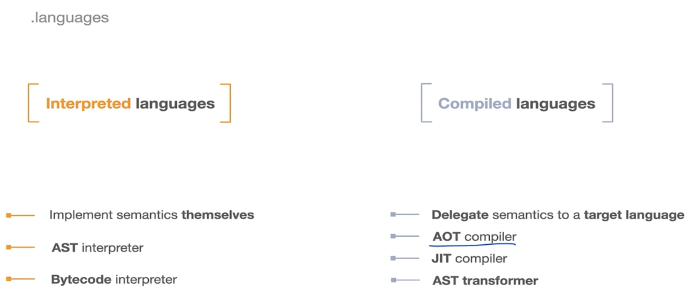
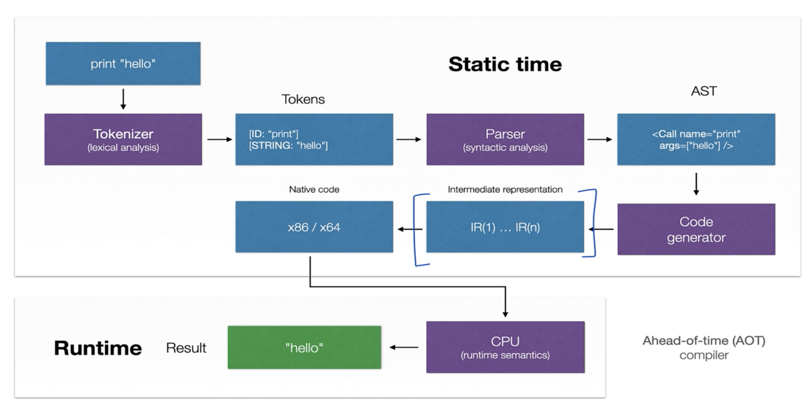
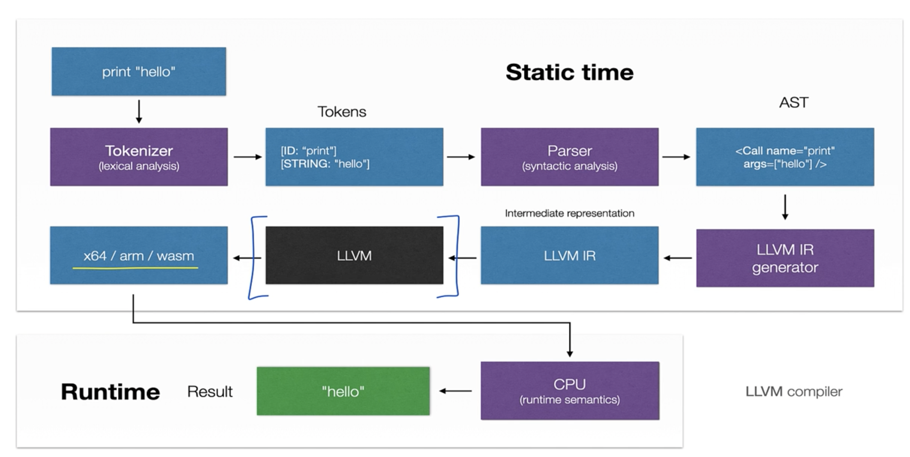
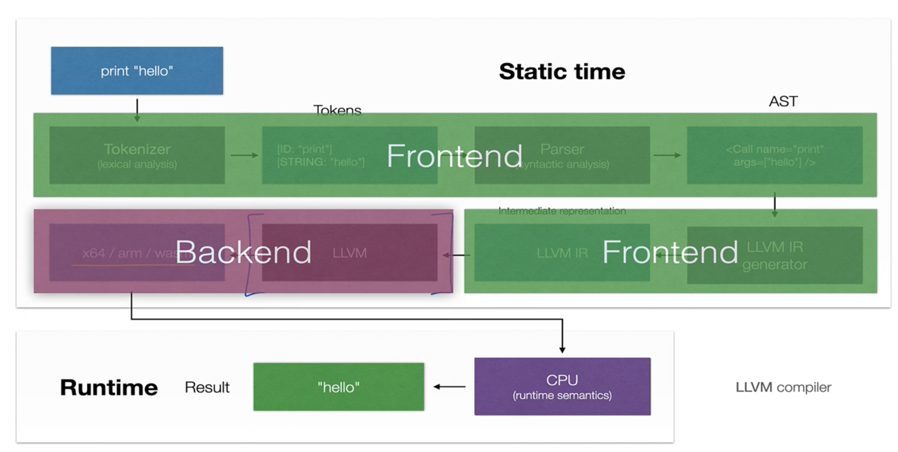
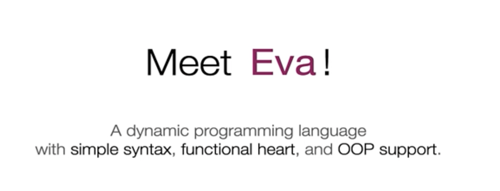
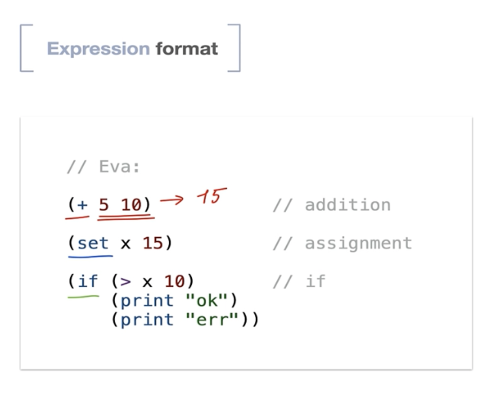
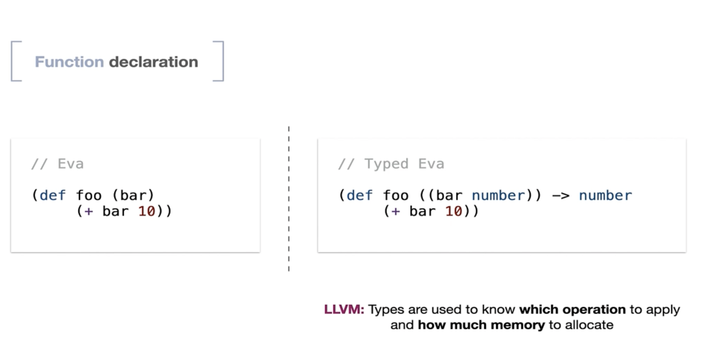

# Objective

- Knowledge Sustainability
  - Generic concepts of `compilation`
  - Design Patterns of `VM` and `Compilers`
  - LLVM `core ecosystem`

### Core concepts

- LLVM is not a `virtual machine` rathger a `compiler infra`

- LLVM supports all:-
  - `inline interpreter`
  - AOT Compiler
  - JIT Compiler

### AOT ( `Translate full src-code to target code before execution` )

- In AOT compiler, 
  - fisrt the src-code "print hello" is send to `tokenizer` (lexical analysis phase)
  - This is tokenized into:-
    - id: "print"
    - [STRING: "hello"]
  - This is then sent to "parser" (can think of the std parsers like `recursive descent parser`)
  - This creates the `AST` (in Syntactic Analysis phase)
  - This `AST` is then sent to "Code Generator phase"
  - Whjich converts it into `intermediate repr` i.e (IR1, IR2, IR3, ..., )
  - Thse are translated to `native code` for specific target arch like " x86 / x64 "
  - This is passed to `CPU`
  - After which we get the `result` 

### LLVM in the picture

- NOTE: LLVM Section starts after "AST
- `src-code` -> `tokenizer` -> `tokens` -> `Parser` -> `AST` -> `(Code-Generator) [LLVM Generator]`  -> `LLVM IR1, LLVM IR2..`  (have specific format) -> `[LLVM Black-Box]`
-> `x64 / x86 arch` -> `cpu` -> `result`

#### FrontEnd and Backend

- Considers FrontEnd as `Uptil LLVM IR`
- Remaining as `Backend`

#### Objective

> [!NOTE]
> - Assume, we have `AST`
> - We will work on creating our own LLVM
> - We will assume (there was some `parser code` that generated "AST" and `s-expression`)
> - We start with this s-expression and feed it to the LLVM
> - This way we can still start working on our LLVM

### Building `eva`

- 

### type-tag and s-expressions

