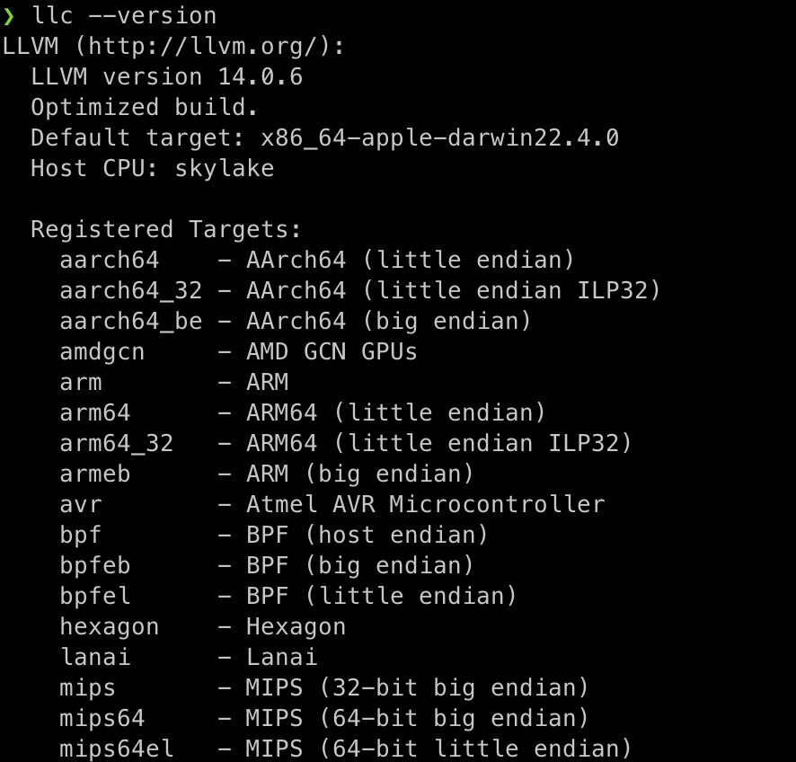
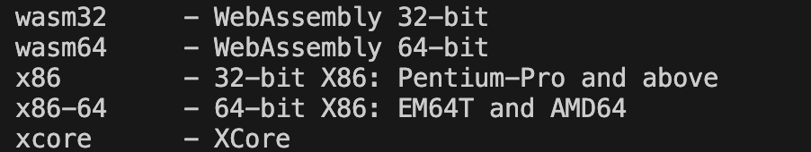

#### Checking the llvm-cmds

- Check mac clang version
  ```bash clang --version
  ```
  - Apple clang version 14.0.3 (clang-1403.0.22.11)
  
- Set corrsponding `llvm port`
  - ```bash
    sudo port select --list llvm
  ```
  - `Selecting 'mp-llvm-14' for 'llvm' succeeded. 'mp-llvm-14' is now active.`

-   - ```bash
    sudo port select --set llvm mp-llvm-14
  ```


  ### List out the llvm-tools
- `llc` is llvm compiler and the tools it brings wqith it
  ```bash
  llc --version
  ```

  

> [!NOTE]
> - This supports multiple targets:-
>   
> - The `wasm` tool says, we can take this code and it can be executed on the web.