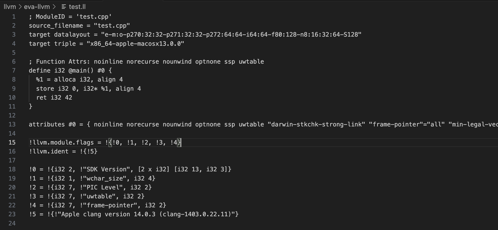

### Create the IR file called `dotll file`


- The test.cpp file created has content
  ```cpp
  int main() { return 42; }
  ```

- In the above cmd `clang++ -S -emit-llvm <cpp_file_name>` means:-
  - clang takes the source file and let it emit `IR` using the cpp file.
  - This creates the `.ll` file.
- Can we use this `.ll` file and create a `binary or executable ` from it?
  - `clang++ -o test test.ll`
  - Creates the binary `test`

### Compiler runs the executable

```bash
./test
echo $?
```
- Returns 42


### We can also use interpreter to run this

```bash
lli test.ll
echo $?
```

- Also, says `42`


### `test.ll` contents


> [!NOTE]
> - The following line with var "target_datalayout" string has `memory layout info` and `alignment info etc` 
> - - `target datalayout = "e-m:o-p270:32:32-p271:32:32-p272:64:64-i64:64-f80:128-n8:16:32:64-S128"
`

- Only executable part of the part `after removing comments`
```bash
  define i32 @main() #0 {
  %1 = alloca i32, align 4
  store i32 0, i32* %1, align 4
  ret i32 42
}
```

- We can remove the `align instructions`
```bash
  define i32 @main() #0 {
  ret i32 42
}
```

- Now, in this `i32` is `integer dtype`
- `@main` -> main() as the global function
- Every function in `.ll` is global function


> [!IMPORTANT]
> - Check running this `trimmed file` ?
> - - Modify `42` to `100`
> - - 


### Using `assembler and inverse i.e disassembler`

- `llvm IR i.e test.ll` is a readable representation of LLVM `bitcode` which is `.bc` file
- Can we gen this `.bc` file?
  - ` llvm-as test.ll `
    - Generates the `test.bc` file.
- Content of this file:
  - `hexdump -C test.bc | less` : Use this in terminal
  
- Verify the inverse tool i.e `llvm-dis`
- `llvm-dis test.bc test2_dis.ll ` gives the `.ll` file

> [!IMPORTANT]
> - `llvm-as` can be used to gen `.bc` file
>   - This file is a `bitcode` repr of the `.ll` which is a llvm-IR file
> - We can use this `.bc` file to gen `.ll` file using `dis` (wchih is inverse operation) 