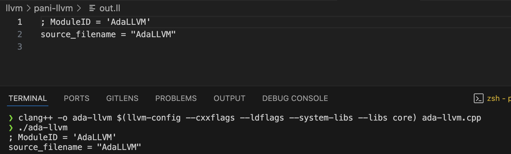

### Recall
- For building our compiler, we need:-
  - Context
    - Contains a number of modules
    - Stores states of modules
    - Shares LLVM's global data and core infra like `types` and `constant tables`
  - Module
    - Container for :-
      - `function definition`
      - `function declaration`
      - `Target M/c metadata`
      - `Global Vars`
    - Creates `LLVM instructions` and puts them inside `BasicBlock` 
  - IRBuilder
    - Takes the `*ctx` as input
    - Emits the `IR data` (recall viz)


### Build a working module using these 3 components and verify

#### Code
```cpp
/* Parses the code and Emits IR */

#ifndef AdaLLVM_h // start of guard
#define AdaLLVM_h // if not defined

#include "string.h"
#include "llvm/IR/LLVMContext.h"
#include "llvm/IR/Module.h"
#include "llvm/IR/IRBuilder.h"


class AdaLLVM {
public:
    AdaLLVM() { moduleInit(); } // constructor inits the modules

    void exec(const std::string& program){
        // takes this program as a const string

        // 1. Parses the code -> Generates the Abstract Syntax Tree
        // auto ast = parser->parse(program); // Can imagine this for now

        // 2. Generates the AST
        /* Imagine we have the ast, currently; Using the compiler
           Walk over the tree and generate the IR, pertaining to each method
           Can imagine .add, etc
        */ 
        // compile(ast); // emits the AST into IR using IRBuilder

        // While executation let's print the output into the llvm outstream
        module->print( llvm::outs(), nullptr ); // raw_fd_ostream is outs(), AssemblyAnnotatorWriter is nullptr

        // 3. saves the genertaed IR to .ll file
        saveModuleToFile("./out.ll");
    }


private:
    /* Some imp. attributes */

    /* Recall The Context 
    - LLVMContext manages and owns the "global" data of LLVM's core
    infra like:-
        -  constant unique tables and types
    Container of other methods
    */
    std::unique_ptr< llvm::LLVMContext > ctx;

    /* Recall the Module */
    /* container of functions, methods and global vars etc */
    std::unique_ptr< llvm::Module > module;

    /* IRBuilder */
    /* It creates the LLVM instructions and puts them into the BasicBlock
     */
    std::unique_ptr< llvm::IRBuilder<> > builder;

private:
    void saveModuleToFile(const std::string& filename){
        // 1. Need error code to hold the error, if file can't be open or writtent o
        std::error_code errorCode;

        // 2. Using this, we can now write into a file (using file descriptor)
        // create a llvm's fd_ostream object that demands filename and errorCode
        llvm::raw_fd_ostream outLL(filename, errorCode); // using llvm's fd_ostream <fd stream>

        // 3. print using module pointer
        module->print(outLL, nullptr); // tries to wrirte into out.ll file and tracks the errors
    }   

    void moduleInit(){
        // 1. init the ctx
        // Create a memory of context in the heap and manage memory leaks by
        // wrapping it by a smart pointer
        ctx = std::make_unique<llvm::LLVMContext>();

        // 2 Using ctx init the module (create the module). Let's call it as AdaLLVM
        // create a blueprint called module and name it as "AdaLLVM"
        // Uses ctx pointer to overwrite this module
        module = std::make_unique<llvm::Module>("AdaLLVM", *ctx); // Trap: This also requires LLVMContext&

        // 3. Using ctx ptr create the builder
        // IRBuilder<>::IRBuilder(LLVMContext&) hence send a ptr
        builder = std::make_unique<llvm::IRBuilder<>>(*ctx);
    }
};

/* End of guard for AdaLLVM header */
#endif
```

- Had issue with `llvm compiler`
  - Fixed it by going to right location of `llvm`
  - Added in cpp-json file of vs-code `IncludesWith`
  - This resolve and found the missing libs


- Coded the class AdaLLVM => "Parses the program" => "Generates the AST" => "Walks the AST" => "Finally generates the IR data"

- `exec()`
  - Args: `program` as a const string (`to prevent modification`) and `cbr` as ir can be a long string
    - E.g: => R"( 42 )" inside `ada-llvm.cpp` file
- Declaraion and init of the above 3 parts in high level
    - Declaration was done as `private` attributes
      - All 3 as `std::unique_ptr<T>`
        - Template i.e `T` is:-
          - Context
            - `llvm::LLVMContext`
          - Module
            - `llvm::Module`
          - IRBuilder
            - `llvm::IRBuilder<>`
            - `<>` missing was a Trap
    - Init was done by a private `moduleInit` method()
      - moduleInit()
        - `make_unique` : safe way to init a `unique_ptr`
        - `ctx = std::make_unique< llvm::LLVMContext >()`
        - `module = std::make_unique< llvm::Module >("ModuleName", *ctx);` 2nd arg requires LLVMContext
        - `builder = std::make_unique< llvm::ITBuilder<> >(*ctx);` 2nd arg requires LLVMContext
        > - [!NOTE]
        > - `unique_ptr` decision was made as I needed `automatic` resolution of `memory leaks` issue of `raw ptr`
        > - Uniquely wraps an `llvm class object`
        > - No copy, only move


#### `saveModuleToFile()`

```cpp
   void saveModuleToFile(const std::string& filename){
      // 1. Need error code to hold the error, if file can't be open or writtent o
      std::error_code errorCode;

      // 2. Using this, we can now write into a file (using file descriptor)
      // create a llvm's fd_ostream object that demands filename and errorCode
      llvm::raw_fd_ostream outLL(filename, errorCode); // using llvm's fd_ostream <fd stream> NOTE: `outLL is a user-defined objectName`

      // 3. print using module pointer
      module->print(outLL, nullptr); // tries to wrirte into out.ll file and tracks the errors
  }   
```


#### Ran the execuatble
- Takes the program, as input
- Inits the compiler
- Generates the IR

```cpp
/* Executable 
- Takes the program, as input
- Inits the compiler
- Generates the IR
*/

#include<string>
#include "./src/AdaLLVM.h"

int main(){ 

    const std::string program = R"( 42 
    )";

    // init the compiler
    AdaLLVM vm; 

    // Execute
    vm.exec(program);

    return 0;
}
```


> [!NOTE]
> - We need to tell the compiler `paths` and `flags` to use, when compiling, sop that it knows
> - to correctly compile the `LLVM` code.
```bash
clang++ -o ada-llvm $(llvm-config --cxxflags --ldflags --system-libs --libs core) ada-llvm.cpp
```


- This generates the `.ll` and `out/binary file`
- Running this `compiles` AdaLLVM.h correctly as the print stmts:-
  - Inside `exec()`
  - Inside `saveModuleToFile()` 
  - Both, printed in the `terminal` and `.ll` file
  - Recall: `module->print( ostream address, AssemblyAnnotator address )`
  - `module->print( llvm::outs(), nullptr );`
  - Also, `llvm's raw_fd_ostream` i.e 
    - ClassName: llvm::raw_fd_ostream
    - ObjectName: outLL
    - Params: outLL( filename, errorCode )
    - `std::eeror_code` is used to `store` errors when `opening/writing` unto `files`