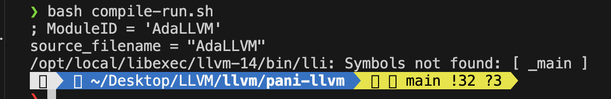
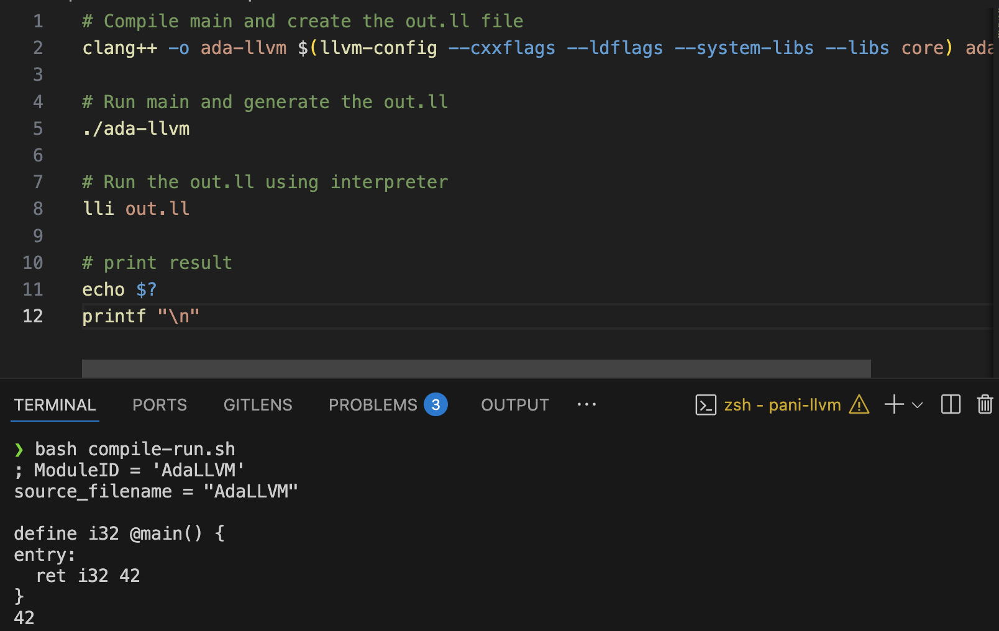
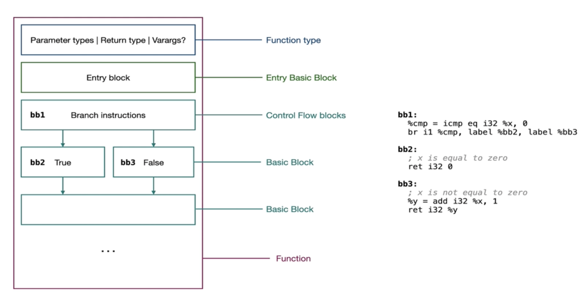
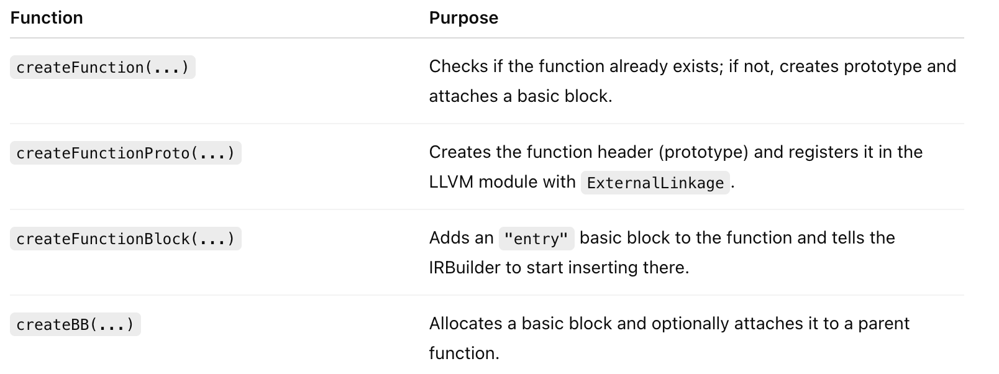

### Objective
- Compile the `main` function

#### Let's optimise the build-system (`Not exactly build-sys`)

```bash
# Compile main and create the out.ll file
clang++ -o ada-llvm $(llvm-config --cxxflags --ldflags --system-libs --libs core) ada-llvm.cpp

# Run main and generate the out.ll
./ada-llvm

# Run the out.ll using interpreter
lli out.ll
```

- The above run of `.sh` file resulted in:-

- The issue emanates from the fact that, the interpreter wasn't abl;e to find an `entry point`; where to start from.


### Solution

- We need to create an `entry` block
- After solving the problem



#### Some basic Observations

- Some llvm frequently used ptrs:-
  - `llvm::Function *`  -> llvm function_ptr used quite often as ret-types, args etc
  - `llvm::BasicBlock *`-> BasicBlock is a fundamental concept in llvm, ptrs to these are creating and manipulating one is also frequent
  - `llvm::Value *` -> most things in llvm are values. Fo e.g: `i32 %x` -> Here, i32 is type and %x is a Value

- Some llvm `Create()` static functions required to build <functions> and <BasicBlocks>
- `llvm::Function::Create()` -> requires Module&
- `llvm::BasicBlock::Create()` -> requires ctx i.e Context&


#### Adding function declarations (`prootypes`) and definitions; adding `Basic Blocks`



##### `compile` code and self-explanatory
```cpp
    void compile(/* TODO: ast */){

        // 1. Create the function main function [can be thoufght of as a block]
        /* define i32 @main  -> includes fnName, retType, argType, varargs*/
        // To create a fn, we need fnName and fnType describing the function
        fn = createFunction("main", 
                            llvm::FunctionType::get( /* llvm::Type* */ builder->getInt32Ty(),
                                                    /* isVarArg required? */ false )
                        ); 

        // 2. Create the function body -> DOne by CodeGen Part of the Viz
        /*
            define i32 @square( i32 %x ){
            entry: ; entry point added by the IRBuilder to point the compiler/interpreter where to start from
                %result = mul i32 %x, %x
                ret i32 result
            }
         */

        // Imagine for now, 42 is main's body
         llvm::Value* result = gen( /* ast */ ); // emits the IR and CodeGen part of pipeline

         // create the caster to cat "42" into i32 rewcall: ret i32 42
        /*   Value *CreateIntCast(Value *V, Type *DestTy, bool isSigned,
            const Twine &Name = "") */
         auto i32Result = builder->CreateIntCast( result, /*  Value* */
                                                  builder->getInt32Ty(), /* DestTy */
                                                  true /* isIsgned? */ 
                                                    );
                                                
        // ret instruction
        // ret i32 42
        i32Result = builder->CreateRet(i32Result);
    }
```

##### Code-Gen Phase [Recall: Taking `AST as input` and `IR as output`]
```cpp
    llvm::Value* gen( /*ast*/ ){
        // ast just has "42" which is the main-fn body [simple body for now]
        // Which we will cast in i32 anmd then createt he Ret (check `compile()`)
        // For now, just create this llvm::Value called "42"
        return builder->getInt32(42);
    }
```


##### Function and basicBlock Creation


- Real-life Analogy (`cpp program`)
  - `createFunction()` = checks if you've already written int main(); if not, writes the skeleton.
  - `createFunctionProto()` = writes the function signature (int main() {).
  - `createFunctionBlock()` = opens the curly braces and creates a place for your code.
  - `createBB()` = writes the label or code block inside the function body.`

```cpp
    /* Checks if function is already present asdking the builder, if not creates the fn-prototype */
    llvm::Function* createFunction( const std::string &fnName, 
                                    llvm::FunctionType* fnType){
        
        /* Checks if fnName is present in the symbol table */
        fn = module->getFunction(fnName); // returns fn-pointer is presnet else nullptr
        
        if(fn == nullptr){
            fn = createFunctionProto(fnName, fnType);
        }

        /* create the entry and other basicBlock */
        createFunctionBlock(fn); // creates the funbction block and attaches to the parent block

        return fn;
    }

    llvm::Function* createFunctionProto( const std::string& fnName,
                                        llvm::FunctionType* fnType ){
    
        /* 1. create and show it to the outside world by ExternalLinkage */
        fn = llvm::Function::Create( 
                                    fnType, /*function type */
                                    llvm::Function::ExternalLinkage, /* Linkage Type */
                                    fnName, /* Name of the func */
                                    *module /* Module& */
         );

        // This is inside Verifier.h
        verifyFunction(*fn); // requires llvm/IR/Verifier.h

        return fn;
    }

    void createFunctionBlock(llvm::Function* fn){
        // create a basic block; allocates memory for this basic block
        /* Recall: 
            define i32 @main(){
            entry: // we are adding this part, this is a BB [a sequence of IR instructions]
            }
        */
        auto entry = createBB("entry", fn);

        // It's always imp to register any new block after irt gets allocated
        // so that the IRBuilder can emit the new block
        builder->SetInsertPoint(entry);
        return;
    }

    llvm::BasicBlock* createBB(const std::string blockName, llvm::Function* fn = nullptr){
        // NOTE:: fn is parent block ptr; NEdded so that we can appened this newly created block
        auto bb_ptr = llvm::BasicBlock::Create( *ctx, blockName, fn );
        return bb_ptr;
    }
```