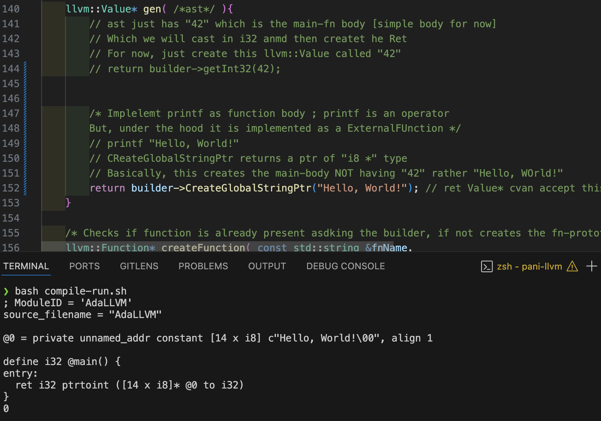
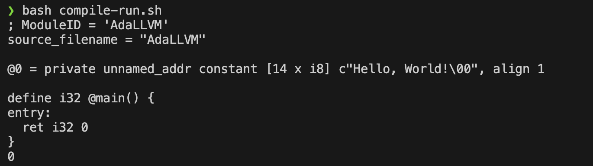
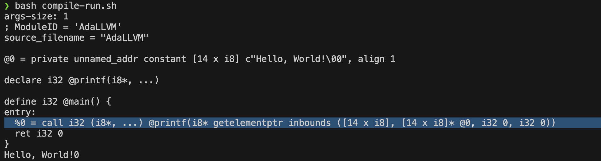

### Printing using passing a simple string in `CodeGen`



> [!NOTE]
> - How the `builder->CreateGLobalStringPtr( my_string )` is called instead of the previous `42` i.e `builder->getInt32(42)`
> - In ther terminal, interseting things:-
>   - `@0` states the string is `global` and named `0`.
>   - [14 x i8] means `14 slots of i8 i.e 1 byte makes up this char-string`
>   - `align 1` : Means it is byte-aligned
>   - Alo, in ret: the type is i32 (This needs to be modified). WHy this happens? Inside `compile()`
>       - gen( ast ) -> Caster -> CreateRet() for `ret instr`
>       - Earlier, 42 was having i32 type, now the function body i.e string is already in correct type. We can simply return 0 for successful termination of program
>       - Just changed `builder->CreateRet( builder->getIntCast32(0) );` inside `compile()`
> 


#### Just declaring printf NOT defining i.e adding body
- Idea: We need to insert `printf` declration in the llvm's module and then print something using this function. First we check if we add the prototype (`or declaration as IR is emiited`)

##### Declaration -> we set this function up and call this from constructor
```cpp
    void setupExternFunctions(){
        /* Idea is: Creating prototype by adding to module; Just declaration NOT definition */
        /* These Extern Functions are telling the compiler, "don't worry, I am not
        defining the function here, rather just declaring"
        These are defined somewhere else (maybe in a diff file)
        Sc: When declaring the prototype `extern <functionSignature>` */

        // Just Insert in the module, this new func

        // int print( const char* format, ...) => Prototype of printf
        auto int8ptr = builder->getInt8Ty()->getPointerTo();
        llvm::FunctionType* printfType = llvm::FunctionType::get(
                                                                    /* ret type */ builder->getInt32Ty(),
                                                                    /* 1st arg type */ int8ptr,
                                                                    /* is varargs? */ true
                                                                );

        
        // add to module: Checks if already DNE, adds to module, later
        // fetch by: module->getFunction()
        module->getOrInsertFunction( "printf", printfType);
    }
```


##### Defining the function body and running a string using printf in `gen()`
- We can basically create call using   `builder->CreateCall()`
  - What this builder->CreateCall() requires is:
    - `printfFn` i.e a function ptr i.e `llvm::Function *`
      - We have inserted this in module
      - Can fetch this by `module->getFunction(<fnName>)`
    - `args-list` i.e printf("%d, %d, Hi\n", 5, 3); Within ""
      - For now args-list.size() is: 1 pointing to "Hello World!"
      - generally vector< llvm::Value* > args{str}; // HelloWorld as global-string-ptr

```cpp
    llvm::Value* gen( /*ast*/ ){
        // ast just has "42" which is the main-fn body [simple body for now]
        // Which we will cast in i32 anmd then createt he Ret
        // For now, just create this llvm::Value called "42"
        // return builder->getInt32(42);


        /* Implelemt printf as function body ; printf is an operator 
        But, under the hood it is implemented as a ExternalFUnction */
        // printf "Hello, World!"
        // CReateGlobalStringPtr returns a ptr of "i8 *" type
        // Basically, this creates the main-body NOT having "42" rather "Hello, WOrld!"
        auto str = builder->CreateGlobalStringPtr("Hello, World!"); // ret Value* cvan accept this ptr
    
        // we have inserted printf declaration in module, can fetch now
        llvm::Function* printfFn = module->getFunction("printf");

        // varargs of printf
        std::vector< llvm::Value* > args{ str }; // [ v*, v*, ... ], each slot points to the arg-list
        std::cout << args.size() << "\n";

        // We can run this using this func pointer and passing this string

        return builder->CreateCall( printfFn, args ); // callee, value* []
    }
```

> [!NOTE]
> - We see the `@0` global label
> - createCall has created this IR-instruction `call`
> - `i32 (i8*, ...)` is signature of printf
> - Them we see, the printf IR
> - As a verification, this was correctly compiled and when run wqe see
>   - `Hello, World!` in o/p. Ignore `0`, should have ,ade `Hello, World!\n` as globalString