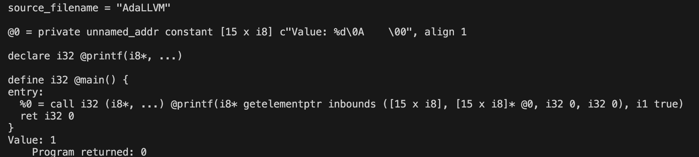
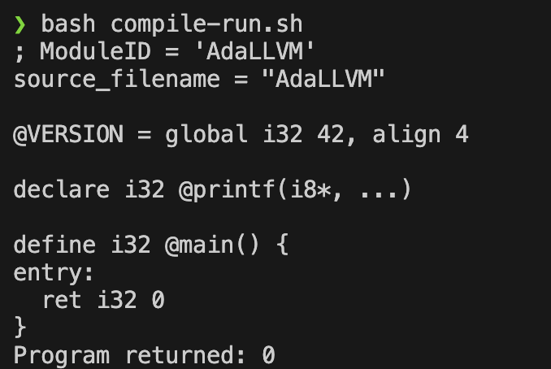
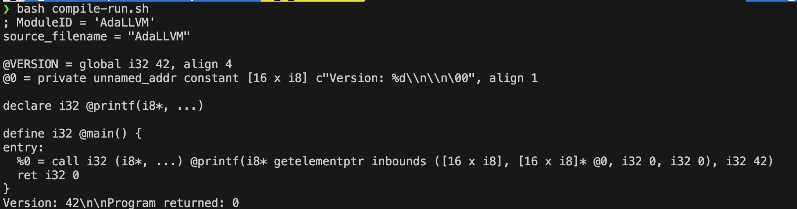

#### Symbols

- Inside gen(), for `Symbols`
```cpp
            /**
             * Symbol
             */
            case ExpType::SYMBOL:
                /**
                 * Boolean
                 * R "(
                 *      (printf "Value: %d\n\n" true) 
                 *  )"
                 */
                if( (ast.string == "true") or (ast.string == "false") ){
                    auto value = ((ast.string == "true") ? true : false);
                    return builder->getInt1(value);
                }
```
- We ask the `ast.string`, for if "true" or "false"
- Accordingly, set the value using `builder->getInt1(...)`
- Int1 as `Intx` here x is num_bits to store variable, bool is 1 bit
- The raw-string here to test is present in the multi-line comment

- Here, in the result, we canm see LLVM understands `true and false` constants and prints `i1 true`


#### Global Variables
- Since R"" for global checking is `(var VERSION 42)`, this will go as a list
- So, we update inside `list`
```cpp
if(tag.type == ExpType::SYMBOL){
                    // get the string i.e fnName or "var"
                    auto op = tag.string;

                    if( op == "var" ){
                        /**
                         * Variables
                         * 1. Local (TODO)
                         * 2. Global
                         *      - R" ( (var VERSION 42) ) " 
                         *      - var: tag
                         *      - VERSION: name of global var i.e varName
                         *      - 42:  init_value
                         */
                        std::string varName = ast.list[1].string; // Trap: ast.list[1] will have Exp("VERSION"), we need to get the string
                        // Initialiser
                        llvm::Value* init_value = gen(ast.list[2]); // ast.list[2] has Exp(42), which is expected for gen
                        // sets properties and of this global variable, just like createFunction
                        llvm::GlobalVariable* g = createGlobalVariable(varName, 
                                                                        (llvm::Constant*)init_value);
                        return g;
                    }
```

##### createGlobalVariable()
```cpp
llvm::GlobalVariable* createGlobalVariable( const std::string& varName, 
                                                llvm::Constant* init_value) {
        // using the module setOrInsert
        module->getOrInsertGlobal(varName, init_value->getType() );
        // fetch once registered
        llvm::GlobalVariable* varFn = module->getNamedGlobal(varName); 
        // set some properties of global: isItConstant, setInitializer, setAlignment
        varFn->setAlignment(llvm::MaybeAlign(4)); // Make thgis variable 4B aligned as int
        varFn->setConstant(false); // multable i.e can be changed
        varFn->setInitializer(init_value);
        return varFn;
    }
```


##### Final O/p

> [!NOTE]
> - @VERSION means `global tag`
> - ALso, it says it is `global` 
> - It is i32 type with value 42
> - Has align 4 i.e `varFn->setAlignment(llvm::MaybeAlign(4))`


#### SSA (Static Single Assignment)

- SSA is an optimisation concept in Compiler Optimisation Concept
- `variables are assigned exactly once`
  - Use different variables for every assignment  
  - If same variabl;e is overwritten -> SSA creates new version everytime
For the below code, the llvm SSA code is:-
```cpp
{
    int x = 10;
    x *= 2;
    x += 5;
}
```

```SSA
%x1 = add i32 0, 10 ; x1 = 0 + 10
%x2 = mul i32 %x1, 2 ; x2 = x1 * 2 NOTE: we use a different var-name
%x3 = add i32 %x2, 5 ; x3 = x2 + 5
```

> - [!NOTE]
> - %1 -> temp. register
> - SSA used. Why?  
>   - Easier for compiler to understand
>   - Compiler optimisations like `dead-code elimination` and `constant propagation`

#### `phi - nodes`

- Basically merges path, based on `control paths` 
- Syntax
  ```llvm
  %res = phi i32 [%x1, %then-block], [%x2, %else-block]
  ```
- If we came from %then-block, res will store %x1
- If we came from %else-block, res will store %x2


if-else merge example clarifies


#### Init Global and create SYMBOL from `SYMBOL(Exp(VERSION))`

- Idea (imp)
  - First we create this global variable called `VERSION` and inits it using thie following code
```cpp
          std::string varName = "VERSION";
        llvm::Constant* init_value = builder->getInt32(42);
        createGlobalVariable(varName, init_value); // creates @VERSION = global i32 42, align 4
```

- Insert the global variable to the module and configure its properties
```cpp
  llvm::GlobalVariable* createGlobalVariable( const std::string& varName, 
                                                llvm::Constant* init_value) {
        // using the module setOrInsert
        module->getOrInsertGlobal(varName, init_value->getType() );
        // fetch once registered
        llvm::GlobalVariable* varFn = module->getNamedGlobal(varName); 
        // set some properties of global: isItConstant, setInitializer, setAlignment
        varFn->setAlignment(llvm::MaybeAlign(4)); // Make thgis variable 4B aligned as int
        varFn->setConstant(false); // multable i.e can be changed
        varFn->setInitializer(init_value);
        return varFn;
    }
  ```
- Final Effect in LLVM IR
  - `@VERSION = global i32 42, align 4`


##### Adding the global vars as `SYMBOL` ExpType
- In `(op == ExpType::SYMBOL)`, `var VERSION 42` => Get the Initialiser of Exp(VERSION) when compiling and emitting IR
```cpp
                else{
                    /**
                     * Global Vars
                     */
                    // (var VERSION 42)
                    // assume we have created the global var named VERSION
                    // stored inside module
                    // ast.string will contain the name
                    auto varName = ast.string;
                    // module->getNamedGlobal(varName); // returns the llvm::GlobalVariable*
                    return module->getNamedGlobal(varName)->getInitializer(); // gets actual value
                }
```

#### Raw String
```cpp
    // recall: constructor (inits parser, module and builder and externFunction like printf) -> parser->parse( this raw string called program )
    // Creates the ast i.e
        // (printf "<below_string>" VERSION)
        // ExpType::LIST
            // Recursively parses
            // [  SYMBOL(Exp(Value)) STRING(Exp(<below_string>)) SYMBOL(Exp(VERSION))  ]
        // Exp([  SYMBOL(Exp(Value)) STRING(Exp(<below_string>)) SYMBOL(Exp(VERSION))  ])

    // Now, we have ast
    // compile(ast) -> Emits the IR i.e creates main(),   creates main-body i.e printf here, creates the Ret
    
    // inline variable usage
    // (printf "Version: %d\n\n" (var VERSION 42)) we should "return g->getInitialiser()" from if(op == "var")
    // (printf "Version: %d\n\n" 42) we should "return g" from if(op == "var") from if(op == "var")
    std::string program = R"( 

        (printf "Version: %d\n\n" (var VERSION 42))

        )";
```

#### Global Output
