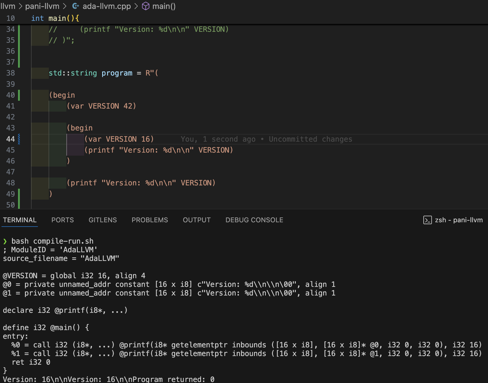
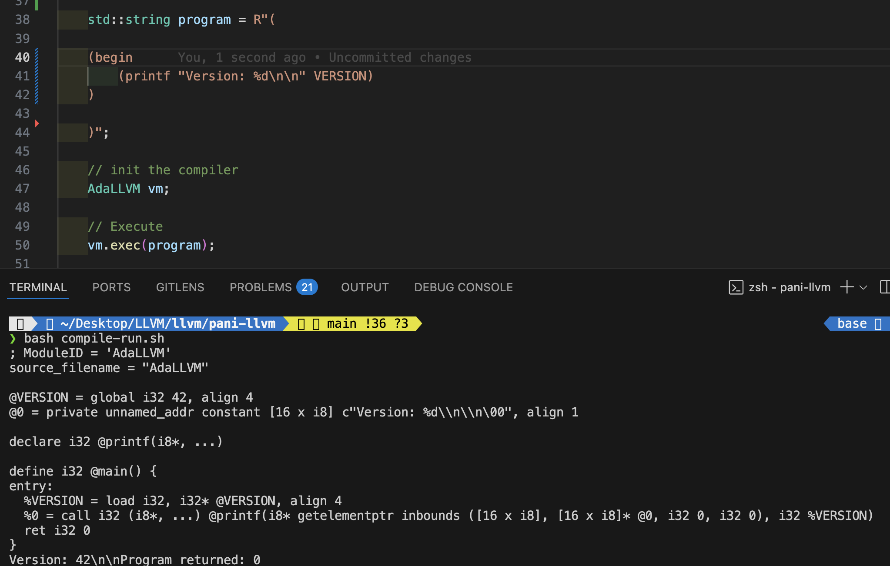

### Block Concept
- We want to implement s.t compiler understands scope/block concept

#### `begin symbols`
The following block parses a begin-block and retuens the very last ret of last block
```cpp
else if(op == "begin"){
                        // (begin <expression>)
                        llvm::Value* retBlock; // parse each block and return the last block
                        for(int i=1; i<ast.list.size(); i++){
                            retBlock = gen(ast.list[i]); //last update will be retBlock
                        }

                        return retBlock;
                    }
```

#### Issue: This version of Compiler can understand only one top level S-expression and NOT multiple-level s-expression

- Soln below -> wrap in a single begin-block
```cpp
    // Blocks Concept
        /* Create a global var called VERSION
        * 
        * Create Local Scope with begin op
        * Within this create a var called VERSION
        * print this local VERSION
        * 
        * Finally, outside this local scope print the global VERSION  
        */


    // Below will fail becoz, of multiple top-level S-expression
    // Soln: Make single top-level s-expression 
    // std::string program = R"(

    //     (var VERSION 42)

    //     (begin 
    //         (var VERSION 42)
    //         (printf "Version: %d\n\n" VERSION)
    //     )

    //     (printf "Version: %d\n\n" VERSION)
    // )";


    std::string program = R"(

    (begin
        (var VERSION 42)

        (begin 
            (var VERSION 16)
            (printf "Version: %d\n\n" VERSION)
        )

        (printf "Version: %d\n\n" VERSION)
    )

    )";

```

> - [!NOTE]
> - Does it solve the problem and understands scoping?
> - No. Loook at the image below
> - 
> - To solve this, we need this concept of environment


#### Environment

- We can think of this as encapsulating 2 types of things
  - parent-env ptr. Why?
    - So, that, when we modify a variable, we can always ask parent -> parent -> parent (scoping)
    - And then modify when first found
  - A list of <variable - value> pairs
  - We would implement this.

```
Idea:-
    - Env 1 (child)
        - _parent ptr: points to `Env2`
        - record_
            - x = 42
            - y = 10

    - Env 2 (parent/global)
        - _parent ptr: nullptr
        - record_
            - z = 2
```


##### Guard Concept
Good practice to always do this for every ".h" file
```cpp

/**
 * Environment.h
 */

// Need to make guard -> header guard
// Multiple files including this -> multiple definitions -> confuses compiler
/**
 * (A.h has included B.h) and (B.h has included A.h) -> circular inclusion
 * Use ifndef, define, endif
 *  - This will included defn of B.h when compiling A.h
 * - When we next compile B.h, it can see the defintions of A.h hence will skip the include
 * - At the end of the day, 
 * we include a file to get all the functions, classes, vars which is achieved even if we skip 
 * */ 

#ifndef Environment_h 
#define Environment_h


#endif
```


#### Environment.h <self-explanatory code with comments>
```cpp

/**
 * Environment.h
 */

// Need to make guard -> header guard
// Multiple files including this -> multiple definitions -> confuses compiler
/**
 * (A.h has included B.h) and (B.h has included A.h) -> circular inclusion
 * Use ifndef, define, endif
 *  - This will included defn of B.h when compiling A.h
 * - When we next compile B.h, it can see the defintions of A.h hence will skip the include
 * - At the end of the day, 
 * we include a file to get all the functions, classes, vars which is achieved even if we skip 
 * */ 

#ifndef Environment_h 
#define Environment_h

#include<sstream>
#include<memory>
#include<map>
#include "llvm/IR/Value.h"

#include "./Logger.h"

// inheriting std::enable_shared_from_this<Environment> -> will support creation of
// shared pointer to itself (i.e this class-obj)
class Environment : public std::enable_shared_from_this<Environment> {
public:
    Environment(std::map<std::string, llvm::Value*> record, 
                std::shared_ptr<Environment> parent) 
                : record_(record), parent_(parent) {} // Trap

    /**
     * define i.e setter
     * sets the varName and its value in this Environment
     */
    llvm::Value* define(std::string &name, llvm::Value* val){
        // Every var will be called from gen( <with Env>)
            // For every new var we can define it. Reason: Env->define(name)
        record_[name] = val;
        return val;
    }

    /**
     * lookup i.e getter
     * Finds the "scope" of a given variable
     * "scope" can be thought of as shared_ptr<Environment> i.e ptr to the Environment it belongs to
     * lookup solves this by asking this question recursively and travsersing a chain of parents
     * It retuens the value from the env it finds it for first time
     */
    llvm::Value* lookup(std::string &name){ 
        auto env = resolve(name); // ptr
        return env->record_[name]; // ptr wrapping this class containing this map DS with key name
    }

    /**
     * resolve
     */
    std::shared_ptr<Environment> resolve(const std::string &name){
        // if it finds it here for the first time
        // At every recurssion, we will be present in the cur Env
        // We can access members by shared_ptr as it inherits `std::enable_shared_from_this<Environment>`
        if( record_.count(name) != 0 ){
            // return this; // won't work but intend to do this
            return shared_from_this();
        }

        // If we have reahed topmost parent i.e whose parent is nullptr
        if( parent_ == nullptr )
        {
            // This var was in NO env -> cerr
            // write-and-exit concept
            DIE << "Couldn't Find Such a Variable with name: " << name;
        }

        // keep recursing
        return parent_->resolve(name); // update the Env i.e parent-Env and call its resolve method
    }

private:
    /**
     * parent: Which will be a shared ptr
     * As multiple Env can have the same parent-Env
     */
    std::shared_ptr<Environment> parent_; // inside memory.h

    /**
     * record_
     * - Stores all the varNames, fnNames etc and other SYYMBOLS
     */
    std::map<std::string, llvm::Value*> record_;
};

#endif
```


#### Logger

```cpp
/* logger.h */

/**
 * write and exit concept
 * We want to support functionalities of a out-stream
 * That stores the Error Message as a string into buffer
 * Suports functionailities of a stream like cin , cout, cerr
 * And Exits/Terminates the Program due to an error
 */

#ifndef Logger_h
#define Logger_h

#include <sstream>
#include <iostream>

class ErrorLogMessage : public std::basic_ostringstream<char> {
public:
    ~ErrorLogMessage(){ 
        // before getting out-of-scope
        /* It Stores the msg and exits */
        // NOTE:: `DIE <<` has put the message n buffer
        // str() will fetch the contents of the Buffer and c_str() converts to c-readable string
        std::cerr << "Fatal Error: " << str().c_str();
        exit(EXIT_FAILURE);
    }
};


#define DIE ErrorLogMessage()
#endif
```


#### Creating Blocks and SYMBOLS with `global and local scope`

Final Result at the end 

> - [!NOTE]
> - Although, we can see the local variables are recognised
> - `%VERSION = load i32, i32* @VERSION`
>   - What this means is:-  The value at address of `global-VERSION` is used OR read from global and assign to local
>   - Hence, this `begin` still doesn't create a scope
>   - We will solve the issue, next.