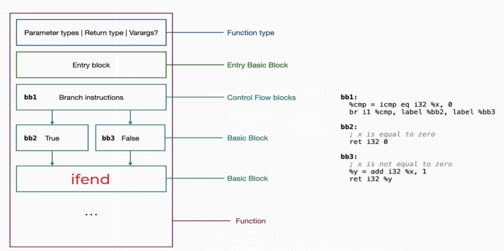
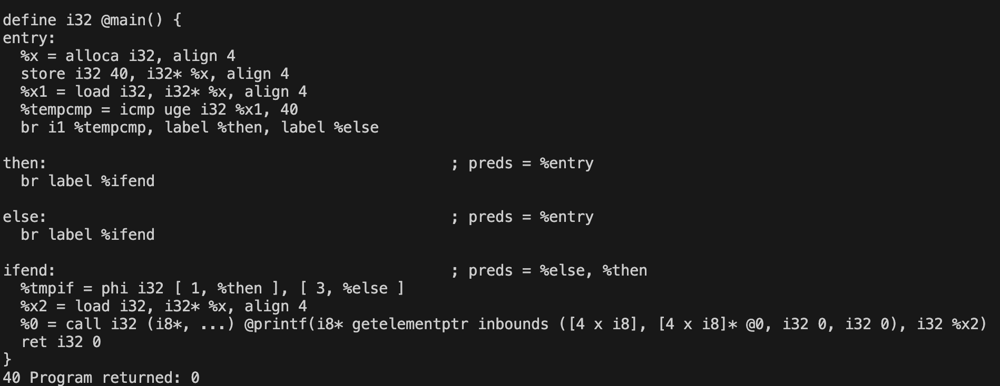
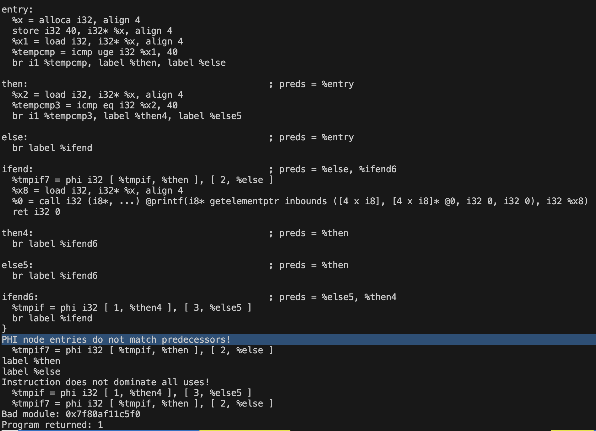

#### Control Flow Bracnching Example



#### if-condition

- `if expression form`
  - <if> <cond> <then> <else>
- Trap: `No ifBlock` rather `thenBlock`
- `createBB()` -> We want to create the blocks so, that it creates the `labels`
  - Pertaining to each label, we emit code under that label
- But, IRBuilder is a `state-m/c` i.e we need to know where to emit code based on
  - `current BasicBlock` + `instruction point within the basic block`
  - For example:- We want to create IR instructions within a `block`
  - First, we point the IRBuilder to that position
  - So, that we can emit code there.
  - So, insert point, needs to be set. Then, compile here.
  - Once, we compile, either `CreateCondBr()` i.e `conditional-branch conmtrol flow` OR `CreateBr()` i.e `unconditional branch control flow`

> [!NOTE]
> - compile `<cond>`. We need this to create the `CreateCondBr` i.e `split control-flow`
> - create `elseBlock`, `thenBlock` and `ifEndBlock`
> - Cond-Branch Instruction
>   - `builder->CreateCondBr( <cond-compiled>, <if-true-Block>, <if-False-Block> )`, last 2 `llvm::Block*`
> - State-Machine -> Need to move inside, elseBlock
>   - `builder->SetInsertPoint(elseBlock)`
>   - compile `<else>`
>   - Uncond-Branch to ifEndBlock i.e `builder->CreateBr(ifEndBlock)`

> - State-Machine -> Need to move inside, thenBlock
>   - `builder->SetInsertPoint(thenBlock)`
>   - compile `<then>`
>   - Uncond-Branch to ifEndBlock i.e `builder->CreateBr(ifEndBlock)`
>
> Here, we need to be present inside the `ifEndBlock` to `merge control-flow`
> - `builder->SetInsertPoint(ifEndBlock)`
> - We need to create `PHI` instruction for `merge control-flow`
>   - `builder->CreatePHI( Type?, <how-many-incoming-edges-to-merge?>, <Name?> )`
>   - Add incoming edges

```cpp
 /*========== Control Flow =========================== */
                    else if( op == "if" ){
                        /* Idea

                            - R string
                                (begin
                                        (var x 40)
                                        (if (>= x 40)
                                            1
                                            3
                                        )
                                        (printf "%d " x)
                                    )
                            - <if> <cond> <then> <else>
                            - Compile the condition and generate IR for that
                            - We need to create the basicBlocks
                                - ifBlock, elseBlock, ifEndBlock 
                        */

                        // Compile the <cond>: (>= x 40)
                        // The following compilation emits:- if (>= x 40)
                            // %cond = icmp i1 sge i32 40
                        auto cond = gen(ast.list[1], env);

                        // create blocks
                        // creates label "then", "else", 
                        auto thenBlock = createBB("then", fn);
                        auto elseBlock = createBB("else", fn); // should we attach to fn as parent?
                        auto ifEndBlock = createBB("ifend", fn); // should we attch fn as parent? Is it coming from there?
                        
                        // COnditional Branch
                        // create cond-branching instruction i.e control-flow split inst
                        // split control-flow: if <cond> <then> <else> : This control flow is created
                        // br i1 %cond, label thenBlock, label elseBlock    -> This is emitted
                        builder->CreateCondBr(cond, thenBlock, elseBlock); 

                        // Then branch
                        // Bring pen(Builder) to location where we want to emit
                        builder->SetInsertPoint(thenBlock); // here, I want to wmit IR
                        // resolve and compile the IR, of then i.e thenRes
                        // (if <cond> <then>) -> list[2]
                        // emits IR: then here is return 1 and goto ifEndBlock
                        // br 
                        auto thenRes = gen(ast.list[2], env); // compile: <then>
                        // uncond goto ifend with the ret value
                        // br label %ifend
                        builder->CreateBr(ifEndBlock);

                        // Else Branch
                        // Bring IRBuilder to the state: <ElseBlock, IR-instr>
                        builder->SetInsertPoint(elseBlock);
                        // Compile: <else> -> ( if <cond> <then> <else> )
                        auto elseRes = gen(ast.list[3], env);
                        // create uncond br to ifend
                        builder->CreateBr(ifEndBlock);

                        // ifEnd Branch: Where we merge the control-flow
                        // Needs to know based on from it came from, which value to return
                        // Needs phi instruction for control-flow merge instr
                        builder->SetInsertPoint(ifEndBlock);
                        // create PHI node
                        auto phi = builder->CreatePHI( builder->getInt32Ty(), /* llvm::Type* */ 
                                            2, 
                                            "tmpif"
                                          );
                        // merge them, we need to have the thenBlock and elseBlock
                        // pushed to BasicBlocksList() prior to adding the incoming of phi node
                            // This we have already donw, when sending the parent-fn createBB()
                        phi->addIncoming(thenRes, thenBlock); // llvm::Value*, llvm::BasicBlock*
                        phi->addIncoming(elseRes, elseBlock); // llvm::Value*, llvm::BasicBlock*
                        
                        // Above 3 will create:
                            // ifend:
                               // phi i32 [1, %thenBlock], [3, %elseBlock]
                        return phi;
                    }
```

- Output for `unnested-if`
- 
  - In the above image, the instruction:-
    - ` %tempcmp = icmp uge i32 %x1, 40` instruction is emitted by `gen( <cond>, env )`
    - `br i1 %tempcmp, label %then, label %else` is emitted whrn we create conditional branch
    - Next `thenBlock`, we simply emit `UncondBranch` to `ifEndBlock`
    - Same for `elseBlock` to `ifEndBlock`
    - Finally, the most interesting `branch` i.e `ifend`, merge control-flow
    - `%tmpif = phi i32 [ 1, %then ], [ 3, %else ]`


#### Issue: `nested-if` Error
- Raw string
  -     "(begin
            (var x 40)
            (if (>= x 40)
                (if (== x 40)
                    1
                    3
                )
                2
            )
            (printf "%d " x)
        )"

- Output
  - 


#### Solution: `nested-if` Error

```cpp
/*========== Control Flow =========================== */
                    else if( op == "if" ){
                        /* Idea

                            - R string
                                (begin
                                        (var x 40)
                                        (if (>= x 40)
                                            1
                                            3
                                        )
                                        (printf "%d " x)
                                    )
                            - <if> <cond> <then> <else>
                            - Compile the condition and generate IR for that
                            - We need to create the basicBlocks
                                - ifBlock, elseBlock, ifEndBlock 
                        */

                        // Compile the <cond>: (>= x 40)
                        // The following compilation emits:- if (>= x 40)
                            // %cond = icmp i1 sge i32 40
                        auto cond = gen(ast.list[1], env);

                        // create blocks
                        // creates label "then", "else", 
                        auto thenBlock = createBB("then", fn);
                        auto elseBlock = createBB("else"); // Let's not attach right-away to parent
                        auto ifEndBlock = createBB("ifend"); // Wont attach to parent. As we wont be emitting code here, right-away
                        
                        // Conditional Branch
                        // create cond-branching instruction i.e control-flow split inst
                        // split control-flow: if <cond> <then> <else> : This control flow is created
                        // br i1 %cond, label thenBlock, label elseBlock    -> This is emitted
                        builder->CreateCondBr(cond, thenBlock, elseBlock); 

                        // Then branch
                        // Bring pen(Builder) to location where we want to emit
                        builder->SetInsertPoint(thenBlock); // here, I want to wmit IR
                        // resolve and compile the IR, of then i.e thenRes
                        // (if <cond> <then>) -> list[2]
                        // emits IR: then here is return 1 and goto ifEndBlock
                        // br 
                        auto thenRes = gen(ast.list[2], env); // compile: <then>
                        // uncond goto ifend with the ret value
                        // br label %ifend
                        builder->CreateBr(ifEndBlock);
                        // restore then-block for phi instruction
                        thenBlock = builder->GetInsertBlock();

                        // Else Branch
                        // We need to now, attach it to the basic block list of fn
                            // Why? Needed for phi-node to recognise this and also to restore elseBlock
                        fn->getBasicBlockList().push_back(elseBlock); // attaches elseBlock to parent's func-ptr
                        // Bring IRBuilder to the state: <ElseBlock, IR-instr>
                        builder->SetInsertPoint(elseBlock);
                        // Compile: <else> -> ( if <cond> <then> <else> )
                        auto elseRes = gen(ast.list[3], env);
                        // create uncond br to ifend
                        builder->CreateBr(ifEndBlock);
                        // restore for phi instruction, 
                        // after we have added the IR within a block, there might be a chance we have changed the address
                        elseBlock = builder->GetInsertBlock();

                        // ifEnd Branch: Where we merge the control-flow
                        // attach to parent
                        fn->getBasicBlockList().push_back(ifEndBlock);
                        // Needs to know based on from it came from, which value to return
                        // Needs phi instruction for control-flow merge instr
                        builder->SetInsertPoint(ifEndBlock);
                        // create PHI node
                        auto phi = builder->CreatePHI( builder->getInt32Ty(), /* llvm::Type* */ 
                                            2, 
                                            "tmpif"
                                          );
                        // merge them, we need to have the thenBlock and elseBlock
                        // pushed to BasicBlocksList() prior to adding the incoming of phi node
                            // This we have already donw, when sending the parent-fn createBB()
                        phi->addIncoming(thenRes, thenBlock); // llvm::Value*, llvm::BasicBlock*
                        phi->addIncoming(elseRes, elseBlock); // llvm::Value*, llvm::BasicBlock*
                        
                        // Above 3 will create:
                            // ifend:
                               // phi i32 [1, %thenBlock], [3, %elseBlock]
                        return phi;
                    }
```
> [!NOTE]
> - Need to attach to parent just before `SetInsertPoint()` so that parent's fn-ptr basic-block-list has this currentBB
>   - `fn->getBasicBlockList().pb(<CurrentBlock>)`
> - We need to restore to `currentBasicBlock`. Why?
>   - Some, IR instructions emitted within a block might end-up in differnt blocks 
>   - Some IR may change the `InsertPoint` internally
>   - But, phi instr. needs the `current-state of this block`.
>   - Hence, we do `currentBlock = builder->GetInsertBlock()` 
