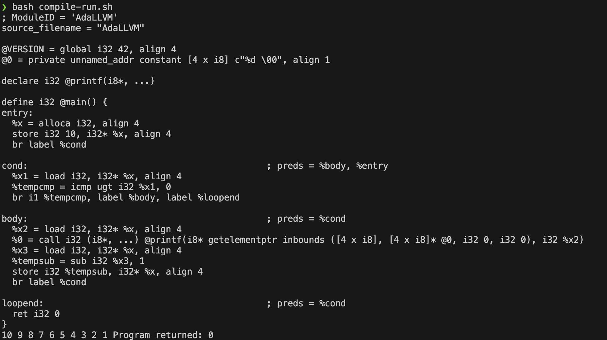

#### while-loop
- The below code since, commented heavily is self-explanatory
```cpp
                    /* (while <cond> <body> ) */
                    else if( op == "while" ){
                        /*
                            (begin
                                (var x 10)
                                (while (> x 0)
                                    (begin
                                        (printf "%d " x)
                                        (set x (- x 1))
                                    )
                                )
                            )
                        */
                        // Here we are in label entry: i.e We are in entry-block
                        // From entryBlock, w/o any cond we move to condBlock

                        // entry to condBlock, as we want to emit/compile <cond> inside condBlock
                        /* 
                        * entry:
                        * br label %condBlock
                        */
                        auto condBlock = createBB("cond", fn);
                        builder->CreateBr(condBlock); // br label %condBlock

                        // =========== condBlock ====================
                        // Inside condBlock, we compile <cond>
                        // <cond> here: (> x 0)
                        // Based on this we goto bodyBlock or loopEndBlock
                        // Since, we need to emit this conditional Branch IR, we need to create these 2 blocks
                        // cond -> T -> body
                        // cond -> F -> loopend ; We need to creat this condbranch
                        auto bodyBlock = createBB("body");
                        auto loopEndBlock = createBB("loopend");

                        // compile <cond> : (> x 0) 
                        // still in entryBlock -> SetInsertPoint to condBlock
                        builder->SetInsertPoint(condBlock); // Trap
                        // %cmp = icmp i1 ugt i32 %x, 0
                        auto condRes = gen(ast.list[1], env);

                        // conditional br
                        // br i1 %cmp, label %body, label %loopend
                        builder->CreateCondBr(condRes, bodyBlock, loopEndBlock);
                        // =========== condBlock ====================


                        // =========== bodyBlock ====================
                        // register the parent in parent-fn's BasicBlockList
                        fn->getBasicBlockList().push_back(bodyBlock); 
                        // Currently inside condBlock => IRBuilder is a state-m/c
                        builder->SetInsertPoint(bodyBlock); 
                        // compile <body>
                        auto bodyRes = gen(ast.list[2], env); // printf and x -= 1 etc
                        // This is how we createt the looping structure
                            // already codBlock -> bodyBlock in CreateCondBr()
                        // Here, since body was successfully executed, we loopBack to condBlock
                            // Inside condBlock, we can run the cond-branch instr
                        builder->CreateBr(condBlock); // br label %cond from bodyBlock
                        // =========== bodyBlock ====================
                        
                        // =========== loopEndBlock ====================
                        // register the parent in parent-fn's BasicBlockList
                        fn->getBasicBlockList().push_back(loopEndBlock); 
                        // Currently inside bodyBlock => IRBuilder is a state-m/c
                        builder->SetInsertPoint(loopEndBlock); 
                        // We dont loop back, rather the next sequence of IR
                        // =========== loopEndBlock ====================

                        return builder->getInt32(0);
                    }
                    /*========== Control Flow =========================== */
```

#### Output



> [!NOTE]
> - Can you notice the difference b/w `if and while`?
> - Register down [TBD]